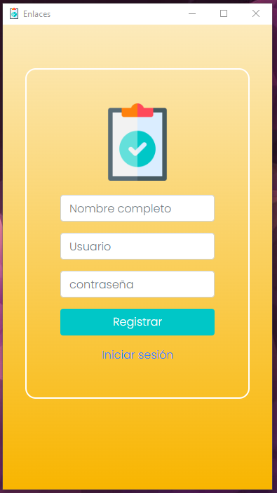
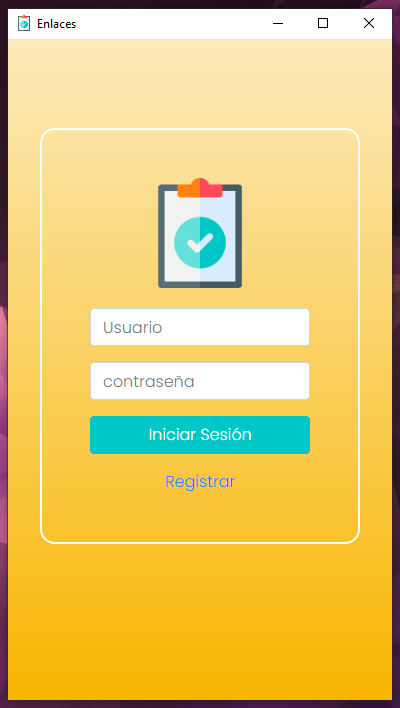
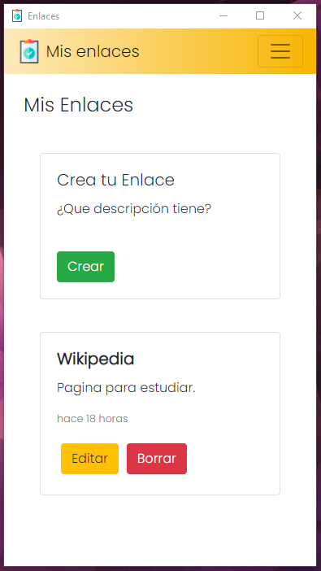

## Proyecto enlaces favoritos

Programa para registrar enlaces destacados agregando descripción.

Programa basado en el lenguaje de Programación `JavaScript`
> Electron\
> Axios\
> Timeago.js

## Estado Proyecto
(completo)

## Imagenes del Proyecto

*Vista Registro*\

*Vista Login*\

*Vista Inicio*\

## Instalacion

Clonar el repositorio. Necesita `node` y `npm` instalado globalmente en tu equipo.

Instalar:

`instalar npm`    

Iniciar el programa:

`npm start`    

> Recuarda que debe esta conectado al api.
